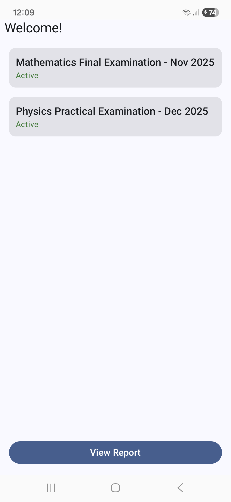
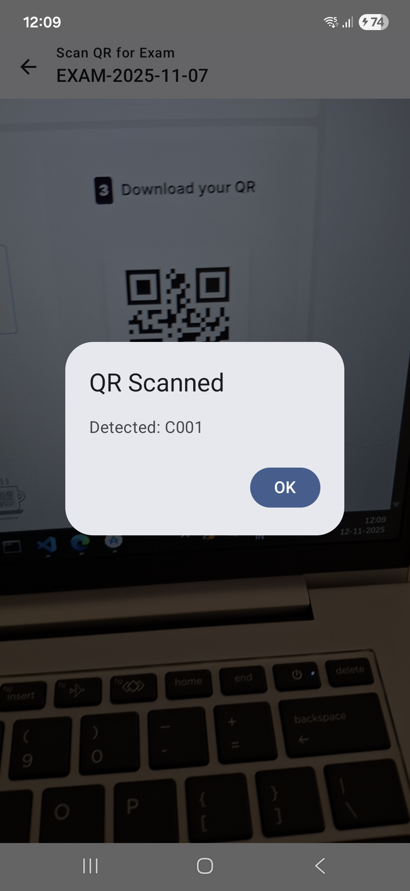
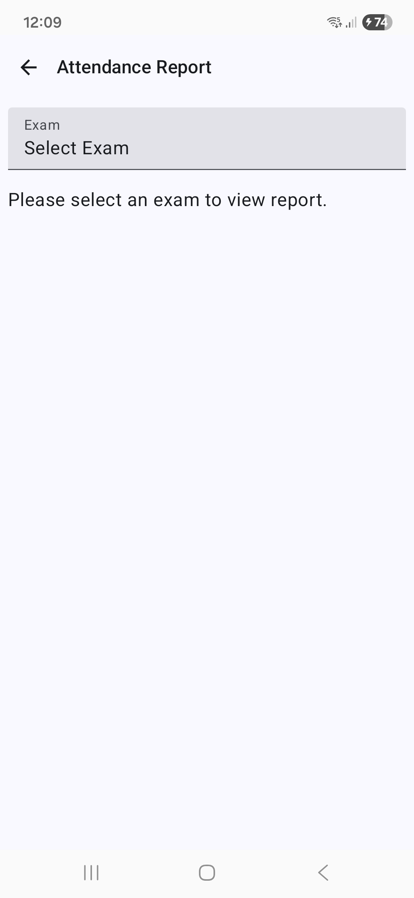
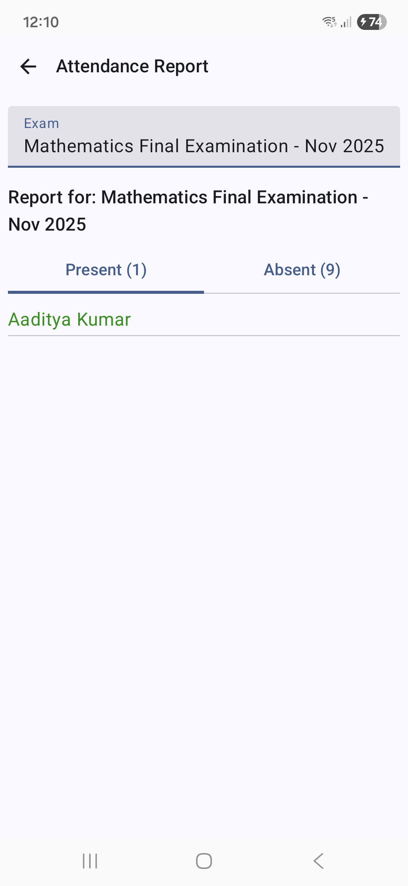
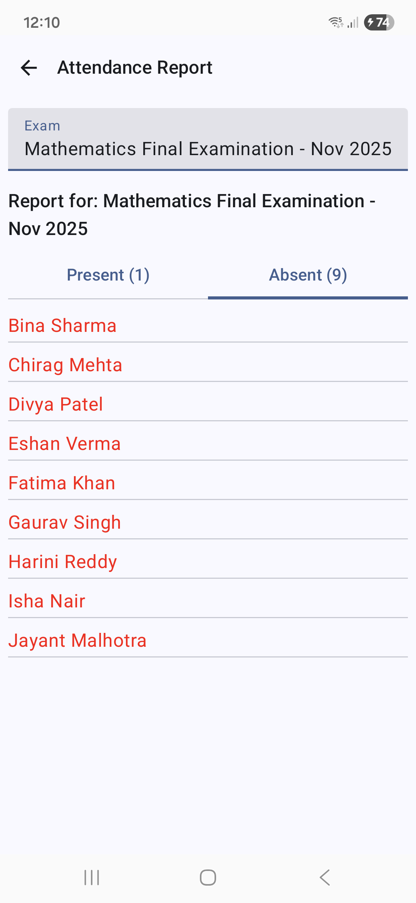

<a href="https://github.com/alekh-pwc/ExamAttendance2/raw/refs/heads/main/app/release/app-release.apk">APK Download Link</a>
# Exam Attendance App

An Android application for managing exam attendance using QR code scanning. Candidates' presence is marked by scanning QR codes, with data synced from a backend API to a local Room database.

## Features

- **QR Code Scanning**: Real-time QR code detection using ML Kit Barcode Scanner
- **Attendance Marking**: Mark candidate presence by scanning admit card QR codes
- **Data Sync**: Fetch exam and candidate data from API and sync to local database
- **Offline Support**: Local database caching for offline access
- **Dashboard**: View all exams and their candidate attendance status
- **Report View**: Generate and view attendance reports per exam
- **Permission Handling**: Camera permissions with runtime permission requests

## 📸 Screenshots

### Screen Overview

<div align="center">

**Splash Screen**  


**Dashboard Screen**  


**Scanner Screen**  


**Report Screen**  


**Additional Screen**  


</div>

### Screen Descriptions

| Screen | Purpose |
|--------|---------|
| **Splash** | Initial app loading screen with branding |
| **Dashboard** | Lists all exams with candidate attendance count |
| **Scanner** | Real-time camera view for QR code detection |
| **Report** | Displays detailed attendance report per exam |
| **Additional** | Supplementary features and options |

## Architecture

The app follows **MVVM (Model-View-ViewModel)** architecture with a **Repository pattern**:

```
├── app.kt                          # Hilt Application class
├── MainActivity.kt                 # Main Activity (hosts Compose NavHost)
│
├── ui/                             # User Interface (Jetpack Compose)
│   ├── dashboard/                  # Dashboard screen & ViewModel
│   ├── scanner/                    # Scanner screen & ViewModel
│   ├── report/                     # Report screen & ViewModel
│   ├── splash/                     # Splash screen
│   ├── navigation/                 # Navigation hosts & routes
│   └── theme/                      # Material3 theme configuration
│
├── data/                           # Data layer
│   ├── api/                        # Retrofit API interface & DTOs
│   │   ├── ExamsApi.kt             # API service (Retrofit)
│   │   └── ExamsDto.kt             # Data Transfer Objects (Moshi)
│   ├── db/                         # Room Database
│   │   ├── AppDatabase.kt          # Database class
│   │   ├── ExamDao.kt              # Exam & Candidate DAO
│   │   └── *.kt                    # Other DAOs
│   └── repository/                 # Repository pattern
│       └── ExamsRepository.kt      # Data orchestration (API + DB)
│
├── domain/                         # Domain layer
│   ├── model/                      # Entity classes
│   │   ├── ExamEntity.kt           # Exam entity with Room annotations
│   │   └── CandidateEntity.kt      # Candidate entity with Room annotations
│   └── usecase/                    # Business logic (if needed)
│
└── di/                             # Dependency Injection (Hilt)
    └── AppModule.kt                # Provides Retrofit, Room, Daos, etc.
```

##  Technology Stack

| Component | Technology |
|-----------|------------|
| **UI Framework** | Jetpack Compose + Material3 |
| **Language** | Kotlin |
| **Navigation** | Jetpack Navigation Compose |
| **Architecture** | MVVM + Repository Pattern |
| **Dependency Injection** | Hilt |
| **Networking** | Retrofit + Moshi |
| **Database** | Room (SQLite) |
| **Camera** | CameraX + ML Kit Barcode Scanner |
| **Async** | Kotlin Coroutines |
| **Lifecycle** | Androidx Lifecycle (ViewModel, StateFlow) |
| **Logging** | Timber |

**ExamEntity** (`domain/model/ExamEntity.kt`)
```kotlin
@Entity
data class ExamEntity(
    @PrimaryKey val id: String,
    val examName: String,
    val date: String,
    val location: String,
    val totalCandidates: Int,
    val presentCount: Int = 0
)
```

**CandidateEntity** (`domain/model/CandidateEntity.kt`)
```kotlin
@Entity
data class CandidateEntity(
    @PrimaryKey val id: String,
    val examId: String,
    val name: String,
    val roll: String,
    val admitQr: String,
    val isPresent: Boolean = false
)
```

### API & DTOs

**ExamsDto** (`data/api/ExamsDto.kt`)
```kotlin
data class ExamDto(
    val id: String,
    val examName: String,
    val date: String,
    val location: String,
    val candidates: List<CandidateDto>
)

data class CandidateDto(
    val name: String,
    val roll: String,
    val admitQr: String
)
```

**ExamsApi** (`data/api/ExamsApi.kt`)
```kotlin
interface ExamsApi {
    @GET("exams.json")
    suspend fun getExams(): List<ExamDto>
}
```

### Repository

**ExamsRepository** (`data/repository/ExamsRepository.kt`)
- `syncWithServer()`: Fetches exams from API and syncs to local database
  - Preserves existing candidate `isPresent` flags during merge
  - Uses atomic transaction for consistency
- `markPresence(examId: String, admitQr: String)`: Marks a candidate as present
- `fetchExamsFromDb()`: Returns Flow of all exams from local database
- `getCandidatesByExam(examId: String)`: Returns Flow of candidates for a specific exam


```json
[
  {
    "examId": "exam-2025-11-07",
    "title": "Mathematics Final Examination - Nov 2025",
    "date": "2025-11-07",
    "candidates": [
      { "roll": "R001", "name": "Aaditya Kumar", "admitQr": "C001" },
      { "roll": "R002", "name": "Bina Sharma", "admitQr": "C002" },
      { "roll": "R003", "name": "Chirag Mehta", "admitQr": "C003" },
      { "roll": "R004", "name": "Divya Patel", "admitQr": "C004" },
      { "roll": "R005", "name": "Eshan Verma", "admitQr": "C005" },
      { "roll": "R006", "name": "Fatima Khan", "admitQr": "C006" },
      { "roll": "R007", "name": "Gaurav Singh", "admitQr": "C007" },
      { "roll": "R008", "name": "Harini Reddy", "admitQr": "C008" },
      { "roll": "R009", "name": "Isha Nair", "admitQr": "C009" },
      { "roll": "R010", "name": "Jayant Malhotra", "admitQr": "C010" }
    ]
  },
  {
    "examId": "exam-2025-12-01",
    "title": "Physics Practical Examination - Dec 2025",
    "date": "2025-12-01",
    "candidates": [
      { "roll": "R011", "name": "Karan Thakur", "admitQr": "P001" },
      { "roll": "R012", "name": "Lavanya Das", "admitQr": "P002" },
      { "roll": "R013", "name": "Manish Jain", "admitQr": "P003" },
      { "roll": "R014", "name": "Neha Gupta", "admitQr": "P004" },
      { "roll": "R015", "name": "Omkar Rao", "admitQr": "P005" },
      { "roll": "R016", "name": "Pooja Iyer", "admitQr": "P006" },
      { "roll": "R017", "name": "Raghav Sharma", "admitQr": "P007" },
      { "roll": "R018", "name": "Sneha Bhat", "admitQr": "P008" },
      { "roll": "R019", "name": "Tanya Joseph", "admitQr": "P009" },
      { "roll": "R020", "name": "Utkarsh Mishra", "admitQr": "P010" }
    ]
  }
]
```
